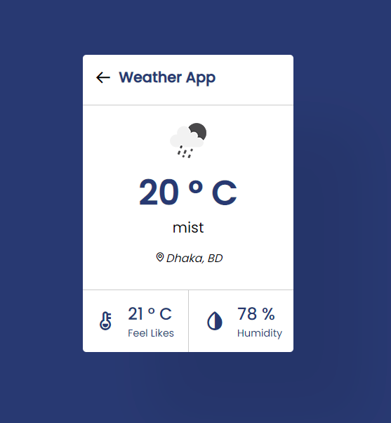

# Weather Application using Vanila JavaScript & API

This is weather application it's perfectly showing up all of things that we need as normal weather application. This application You can search your location. In according to your search terms it's comes up this perticular region weather into the Weather API. And This weather application completely open source. I f you wanna contribute this project please clone it and made of yourself. Thanks 

### Using Technologies
- Vanilla JavaScript
- API
- HTML5/HTML
- CSS3/CSS
- VS Code Editor
- Git bash / Github
- Google Fonts
- Boximicons

## This Demo Screenshot in my project

> Thanks for reachout in github
